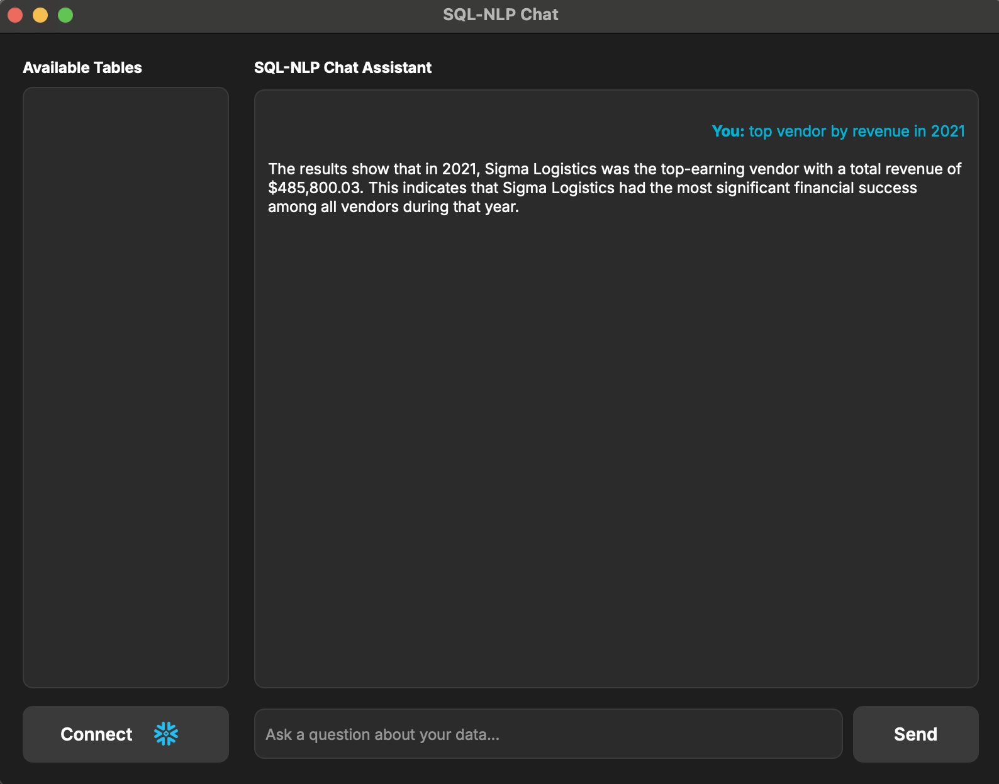

# Natural Language to SQL with Local LLMs  

**DataChat** lets you ask questions in plain English and get accurate SQL queries and insights by using **Ollama** and the **Mistral** model.  
The system retrieves relevant database schema information from **ChromaDB** and generates correct SQL that is executed. Additionally, you can get insights from the executed queries.  

## Features  

- Ask natural-language questions about your data 
- Schema-aware SQL generation using Chroma vector search  
- ChatGPT-style desktop GUI built with PyQt6  

## Workflow  
---
### Schema Embedding  
- The database schema is **embedded** into a **Chroma vector database**.  
- Each **table**, **column**, and **relationship** description is converted into a vector representation using text embeddings.  
- This makes the schema **searchable semantically** — the system can find the most relevant parts of the schema for any question.  
---
### Schema Retrieval  
- When a user asks a question (e.g., *"Which vendor had the highest performance in 2024?"*),  
  the query text is converted into an embedding vector.  
- Chroma performs a **similarity search** to find the most relevant schema fragments.  
- These retrieved tables and columns form the **context** for SQL generation.  
---
### SQL Generation  
- The retrieved schema context and user question are inserted into a **prompt template**. 
- This full prompt is then sent to the **Mistral model** running locally via **Ollama**.  
- The model generates a **syntactically correct SQL query**, following strict rules:
  - Use only existing tables and columns  
  - Prefer explicit JOINs  
  - No commentary, just clean SQL 
---
### Execute SQL
- The generated SQL query is executed on the database.
- Execution can be handled through the SQL_EXECUTE.py module.
---
### Translate Results Back to Natural Language
- The results from SQL execution are passed to the SQL → NLP model.
- The model summarizes or explains the output in plain language for the user.
- ***EXAMPLE*** “The vendor with the highest performance in 2024 is Acme Corp, with a score of 97.”
